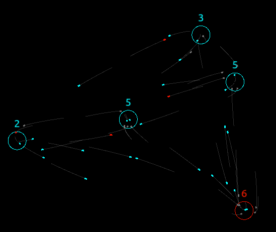

# react-widget-airport

A React widget for Airport animations with flight departures/arrivials.

[1. About](#1-about)  
[2. How It Works](#2-how-it-works)  
&nbsp; &nbsp; [2-1. UMD Library](#2-1-umd-library)  
&nbsp; &nbsp; [2-2. App Structure](#2-2-app-structure)  
&nbsp; &nbsp; &nbsp; &nbsp; [(a) Basic Entry](#a-basic-entry)  
&nbsp; &nbsp; &nbsp; &nbsp; [(b) react-pixi-fiber](#b-react-pixi-fiber)  
&nbsp; &nbsp; &nbsp; &nbsp; [(c) Calling from Other React Apps](#c-calling-from-other-react-apps)  
[3. What I Did](#3-what-i-did)  
&nbsp; &nbsp; [3-1. Installed NPM Packages All](#3-1-installed-npm-packages-all)  
&nbsp; &nbsp; [3-2. Babel](#3-2-babal)  
&nbsp; &nbsp; [3-3. Webpack](#3-3-webpack)  
&nbsp; &nbsp; [3-4. Loaders](#3-4-loaders)  
&nbsp; &nbsp; [3-5. Other Build Tools](#3-5-other-build-tools)  
&nbsp; &nbsp; [3-6. React](#3-6-react)  
&nbsp; &nbsp; [3-7. Other Dependencies](#3-8-other-dependencies)  
[4. Build + Serve](#4-build--serve)  
[5. Notes](#5-notes)  
&nbsp; &nbsp; [5-1. Module Exports Issues](#5-1-module-exports-issues)  
&nbsp; &nbsp; [5-2. `webpack-dev-server`](#5-2-webpack-dev-server)  
&nbsp; &nbsp; [5-3. Emotion & Tailwind](#5-3-emotion--tailwind)  
&nbsp; &nbsp; [5-4. APIPlugin: Using the Webpack hash](#5-4-apiplugin--using-the-webpack-hash) &nbsp; &nbsp; [5-5. Preact](#5-5-preact)  
 
[6. LICENSE](#6-license)  




[View Demo](http://tokyo800.jp/mina/react-widget-airport/)  
(may not work in some browsers: e.g. Facebook browsers)


<a id="about"></a>
## 1. About

#### Embedded React Widget

This is an attempt to show how you can bundle your React app into a widget (UMD library).
I could have made it installed as a dependency for other repos.
As a matter of fact, that is rather a popular approach,
or has more demands when component *reuse* were the concern.
Thus, I would say the demand is very limited.  
Nonetheless, it should help someone out there.

Instead of being **installed**, this app is to be **embedded** in other apps.  
(or, you can totally call it from another React apps.
*[See Example](#c-calling-from-other-react-apps)*)

It exposes the widget globally (in our case `Airport`).  
So, this is how embedding is done:

```html
<script type="text/javascript" src="./airport.app.js"></script>

<script type="text/javascript">
Airport.app.init();
</script>
```

#### React Pixi Fiber

It also demonstrates implementing a canvas animation using
[reac-pixi-fiber](https://github.com/michalochman/react-pixi-fiber).  
Compared to [izzimach/react-pixi](https://github.com/Izzimach/react-pixi),
it is a bit tricky to implement, and I hope it helps someone as well.

Note #1: Another option is to use
[inlet/react-pixi](https://github.com/inlet/react-pixi),
but I had never tried.
See *[the problem](https://github.com/inlet/react-pixi/issues/5)* they have.  
Note #2: Note that `reac-pixi-fiber` does *not* work with `preact`
(See: *[Why](#3-6-react)* or *[Using Preact](#5-5-preact)*).


#### SharedWorker

As you can see, it outputs 2 bundle files (it is not necessary).
One of them is for
*[SharedWorker](https://developer.mozilla.org/en-US/docs/Web/API/SharedWorker),*
and it allows the caller of the widget to send messages to the widget.  
Here is how a caller can send messages to its widget:

```js
const worker = new SharedWorker('./airport.worker.js');

worker.port.postMessage({
  action: 'resize',
  payload: {
    width: window.innerWidth,
    height: window.innerHeight,
  },
});
```

&nbsp;

### # Issues

Yeah. I have some issues. We all fail, right?

- It builds fine, but I could not get `webpack-dev-server` working ([see notes](#5-2-webpack-dev-server)).
- `twin.macro` (Emotion & Tailwind) returns an empty object at runtime ([see notes](#5-3-emotion--tailwind)).
- Externalizing `react`, `react-dom`, `pixi`, `react-pixi`, and `react-pixi-fiber` failed.
[This is how I usually handle externals](https://github.com/minagawah/react-widget-airport/blob/main/webpack.base.js#L18),
but it does not work for UMD...
When I attempt to download the libraries in HTML, both React and Pixi seem to have problems specific to each...
Please help me out!

&nbsp;


## 2. How It Works


### 2-1. UMD Library

Building an UMD library is relatively easy.  
It's just that we frequently bump into problems when working with `babel`...

`webpack.base.js`

```js
  entry: {
    app: './src/index.jsx',
    worker: './src/worker.js',
  },
  output: {
    path: path.resolve(__dirname, 'dist'),
    filename: 'airport.[name].js?[hash]',
    library: ['Airport', '[name]'],
    libraryTarget: 'umd',
  },
```

I have 2 entries in the above, but you can only have 1.  
I have 2 because one of them is for `SharedWorker`,
and it has to be an independent file.

To output only 1, you would do:

```js
  entry: './src/index.jsx',
  output: {
    path: path.resolve(__dirname, 'dist'),
    filename: 'airport.js?[hash]',
    library: 'Airport',
    libraryTarget: 'umd',
  },
```

`[hash]` isn't needed either.  
I am adding `[hash]` so that I don't have to hard reload browsers when making changes.

Now, back to UMD library.

The entry for the library look like this:

`src/index.jsx`

```jsx
export const init = config => {
  ReactDOM.render(
    <Widget config={config} />,
    document.getElementById('airport')
  );
};
```

As you can see, it only exports `init` function using `export`.  
If you want to use `export default`,
then *[you need a special setup for babel](#5-1-module-exports-issues)*.

The module is now exposed globally as `Airport`.

When people want to utilize the widget,
they would download files from `dist` directory,
and embed them in their HTML pages:

- [airport.app.js](dist/airport.app.js) (769 KB)
- [airport.worker.js](dist/airport.worker.js) (114 KB)

For this project, I am using `html-webpack-plugin` to generate a static page,
so that I can test the widget.

`src/index.html`

```html
<!DOCTYPE html>
<html>
<body>
  <div id="airport"></div>

<script type="text/javascript" src="<%= htmlWebpackPlugin.files.js[0] %>"></script>

<script type="text/javascript">
Airport.app.init({
  AIRPORT_RELATED_PARAMS_I WANT_TO_PASS
}); 
</script>

</body>
</html>
```

Notice in the above that

```html
<%= htmlWebpackPlugin.files.js[0] %>
```

is replaced with:

```html
/airport.app.js?[WHATEVER_THE_HASH_GENERATED]
```

Two things to note about the above HTML file.

First of all, we have the HTML only for a *testing* reason.  

Secondly, I could have statically served HTML file.
Instead, I use `html-webpack-plugin` to output to `dist`
because I simply want to append a hash to the file,
so that I don't have to reload hard.

When you want to output UMD library, you don't need an HTML file.
Simple is that.

&nbsp;


### 2-2. App Structure

It is probably worth describing how the app work.

If you are interested only in UMD library, you may stop reading.

#### (a) Basic Entry

So, the app starts when it renders React app into a designated DOM:

`src/index.html`

```html
<div id="airport"></div>

<script type="text/javascript" src="./airport.app.js"></script>
```

`src/index.jsx`

```jsx
import { Widget } from './widget';

export const init = config => {
  ReactDOM.render(
    <Widget config={config} />,
    document.getElementById('airport')
  );
};
```

Here, the prop `config` is totally static, and it is given from whoever passes.  
By saying *"static"*, it means, React won't pick up the changes
even when the starter change the content of the prop.  

#### (b) `react-pixi-fiber`

Now, it is the `Widget` component which renders the actual content:

`src/widget/index.jsx`

```jsx
import { AirportContent as Content } from './content';

export const Widget = ({ config: given }) => {
  const [worker, setWorker] = useState();
  const [stageOptions, setStageOptions] = useState(DEFAULT_STAGE_OPTIONS);
  const [airportOptions, setAirportOptions] = useState(DEFAULT_AIRPORT_OPTIONS);

  useEffect(() => {
    if (!worker) {
      setWorker(
        new SharedWorker(given.worker_file_path || DEFAULT_WORKER_FILE_PATH)
      );
    }
    setAirportOptions(makeAirportOptions(given));
    setStageOptions({
      width: window.innerWidth * 0.65,
      height: window.innerHeight * 0.65,
    });
  }, []);

  useEffect(() => {
    if (worker && worker.port) {

      worker.port.onmessage = (event = {}) => {
        const { data = {} } = event;
        const { action, payload } = data;

        if (action && action === 'resize' && payload) {
          const { width, height } = payload;
          if (width && height) {
            setStageOptions({
              width,
              height,
            });
          }
        }
      };
    }
  }, [worker]);

  return (
    <Stage id="airport-stage" options={stageOptions}>
      <Content
        id="airport-content"
        cw={stageOptions.width}
        ch={stageOptions.height}
        options={airportOptions}
      />
    </Stage>
  );
};
```

in the above, `<Stage>` is a component provided by `react-pixi-fiber`
which does *NOT* render something that we are familiar with,
but it actually renders a `canvas` element.
All the components within `<Stage>` are graphical elements of HTML5 Canvas.

In `Widget` component, the app uses `useState` to set the followings:

- `stageOptions`
- `airportOptions`

`stageOptions` is passed to `<Stage>` so that `reac-pixi-fiber` can decide
the size for the canvas element.

`airportOptions` is for the airport animations only.
When we `init` the widget from the HTML, we *statically* pass `config`.
In `config` prop, we have a bunch fo parameters which define the app behavior.

Also, `Widget` refers to `airport.worker.js`.

```jsx
  setWorker(new SharedWorker('./airport.worker.js'));
```

You can now use this worker to update the size of the widget
from the page you embed the widget
(and I already described how).

&nbsp;


#### (c) Calling from Other React Apps

So, instead of embedding the widget in HTML pages,
you want to call it from other React apps?  
Here is an example from one of my working apps:

```jsx
import React, { useState, useEffect } from 'react';
import { useTranslation } from 'react-i18next';
import tw, { css } from 'twin.macro';

import { useDeviceSize } from '@/hooks/device';
import { useDebounce } from '@/hooks/debounce';
import { Layout } from '@/components/layout';

const MIN_WIDTH = 580;
const DEBOUNCE_MSEC = 1000;
const WORKER_FILE_PATH = '/assets/airport.worker.js';

const layoutStyles = {
  header: tw`bg-black text-white`,
  content: tw`bg-black text-white`,
};

const contentStyle = css`
  min-height: 30vh;
  ${tw`p-4 flex flex-col justify-start items-start`}
`;

export const AirportDemo = () => {
  const { width: dw, height: dh } = useDeviceSize(null);
  const { t } = useTranslation();
  const [worker, setWorker] = useState();

  const dwDelay = useDebounce(dw, DEBOUNCE_MSEC);
  const dhDelay = useDebounce(dh, DEBOUNCE_MSEC);

  const resize = () => {
    let w = dw * 0.75;
    if (w < MIN_WIDTH) {
      w = MIN_WIDTH;
    }
    if (worker) {
      worker.port.postMessage({
        action: 'resize',
        payload: {
          width: w,
          height: w * 0.85,
        },
      });
    }
  };

  useEffect(() => {
    Airport.app.init({ worker_file_path: WORKER_FILE_PATH });

    if (!worker) {
      // Set it only when don't have the worker to prevent from
      // another port being created when it is already mounted.
      setWorker(new SharedWorker(WORKER_FILE_PATH));
    }
  }, []);

  useEffect(() => {
    if (worker && worker.port) {
      resize();
    }
  }, [dwDelay, dhDelay, worker]);

  return (
    <Layout styles={layoutStyles}>
      <div id="content" css={contentStyle}>
        <div id="airport"></div>
      </div>
    </Layout>
  );
};
```

&nbsp;


## 3. What I Did


### 3-1. Installed NPM Packages All


```
yarn add ramda react react-dom pixi.js pixi.js-legacy react-pixi-fiber@1.0.0-beta.4

yarn add --dev @babel/core @babel/preset-env @babel/preset-react @babel/cli core-js@3 @babel/runtime-corejs3 babel-loader file-loader style-loader css-loader postcss-loader webpack webpack-cli webpack-merge clean-webpack-plugin html-webpack-plugin license-webpack-plugin autoprefixer prettier http-server
```


### 3-2. Babel

For `@babel/polyfill` has been deprecated, we use `core-js`.

- @babel/core
- @babel/preset-env
- @babel/cli
- core-js@3
- @babel/runtime-corejs3

```
yarn add --dev @babel/core @babel/preset-env @babel/cli core-js@3 @babel/runtime-corejs3
```


### 3-3. Webpack

- webpack
- webpack-cli

```
yarn add --dev webpack webpack-cli
```

### 3-4. Loaders

- babel-loader
- file-loader
- style-loader
- css-loader
- postcss-loader

```
yarn add --dev babel-loader file-loader style-loader css-loader postcss-loader
```


### 3-5. Other Build Tools

- webpack-merge
- clean-webpack-plugin
- html-webpack-plugin (only for testing)
- license-webpack-plugin
- autoprefixer
- prettier

```
yarn add --dev webpack-merge clean-webpack-plugin html-webpack-plugin license-webpack-plugin autoprefixer prettier
```

### 3-6. React

- @babel/preset-react
- react
- react-dom

```
yarn add react react-dom

yarn add --dev @babel/preset-react
```

I have another project, and it uses
[preact](https://github.com/preactjs/preact),
for the size matters.  
I manated to work alright
(although I need `babel-plugin-transform-react-jsx` for "h" pragma)
for that one.  
However, it did not work with this Airport widget
because `react-pixi-fiber` requires
*reconciliation* which is available for React version 16 and up.

See *[5-5. Preact](#5-5-preact)* if you are planning to use `preact`.

&nbsp;

### 3-7. Other Dependencies

- ramda
- pixi.js
- pixi.js-legacy
- react-pixi-fiber@1.0.0-beta.4 ([issue](https://github.com/michalochman/react-pixi-fiber/issues/156#issuecomment-578214553))
- http-server

```
yarn add ramda pixi.js pixi.js-legacy react-pixi-fiber@1.0.0-beta.4

yarn add --dev http-server
```

Some browsers do not support WebGL the way Pixi v5 wants,
and must fallback to canvas rendering.
There, we need `pixi.js-legacy` instead.  
There are several ways to handle this,
but I found
[a neat solution](https://github.com/inlet/react-pixi/issues/126#issuecomment-514184770),
and this is what I do in this project.  
The idea is to export both `pixi.js` and `pixi.js-legacy` in the codebase,
and use aliases to internally handle names.  
Whenever looking up `pixi.js`, it refers to `src/lib/pixi.js`:

**# webpack.base.js**

```js
  resolve: {
    extensions: ['.js', '.jsx'],
    alias: {
      'pixi.js': path.resolve(__dirname, 'src/lib/pixi.js'),
      'pixi.js-stable': path.resolve(__dirname, 'node_modules/pixi.js'),
      'react-pixi$': 'react-pixi-fiber/react-pixi-alias',
      '@': path.join(__dirname, 'src'),
    },
  },
```

**# src/lib/pixi.js**

```js
export * from 'pixi.js-stable';
export * from 'pixi.js-legacy';
```

where `pixi.js-stable` is a newly defined alias to the original `pixi.js`.


&nbsp;


## 4. Build & Serve

### Build for DEV

```
yarn build:dev
```

Note: `chrome://inspect/#workers` to inspect running workers.


### Build for PROD

```
yarn serve
```

### Serve from: localhost:8000

```
yarn serve
```


&nbsp;


## 5. Notes

### 5-1. Module Exports Issues

When exporting UMD library, you may encounter tons of issues.  
(e.g. `export default`, etc.)  
Here is a list of plugins you may want to dig in:

- <s>@babel/plugin-transform-modules-umd</s>
- @babel/plugin-proposal-export-default-from
- @babel/plugin-proposal-export-namespace-from
- babel-plugin-add-module-exports


### 5-2. `webpack-dev-server`

A bundle works for production, but it fails when using `webpack-dev-server`.  
With `writeToDisk: true` option, although we can read a physical output, it still does not work.  
It loads the library fine, *but exported module becomes an empty object...*


### 5-3. Emotion & Tailwind

Attempt to use `twin.macro` (Twin) for Emotion and Tailwind fails.

Note that Twin v2 was recently released as to support:
- tailwind@2 ([released on Nov. 19, 2020](https://github.com/ben-rogerson/twin.macro/releases/tag/2.0.0))
- emotion@11 ([released on Nov. 12, 2020](https://emotion.sh/docs/emotion-11))

There is an instruction given in the above release note,
but *it seems to fail when building as an UMD library...*

It builds fine, but I get the following runtime error:

```
index.jsx:13 Uncaught ReferenceError: __cssprop is not defined
```

If not for UMD library, it should work just fine.

Another workaround worth consider:  
https://github.com/ben-rogerson/twin.macro/issues/184#issuecomment-727236689

FYI: in case you want to use Twin in a normal manner (not UMD), then here are the packages you need:

- babel-plugin-macros
- @emotion/babel-plugin-jsx-pragmatic
- @emotion/react &lt;-- Not for "devDependencies" but "dependencies".
- @emotion/styled &lt;-- Not for "devDependencies" but "dependencies".
- twin.macro &lt;-- Not for "devDependencies" but "dependencies".

and prepare the following config files:

`babel.config.js`  

```js
module.exports = {
  presets: [
    [
      '@babel/preset-env',
      {
        useBuiltIns: 'entry',
        corejs: 3,
        targets: {
          esmodules: true,
        },
      },
    ],
    '@babel/preset-react',
  ],
  plugins: [
    'babel-plugin-macros',
    [
      '@emotion/babel-plugin-jsx-pragmatic',
      {
        export: 'jsx',
        import: '__cssprop',
        module: '@emotion/react',
      },
    ],
    [
      '@babel/plugin-transform-react-jsx',
      {
        pragma: '__cssprop',
        pragmaFrag: 'React.Fragment',
      },
    ],
  ],
};
```

`babel-plugin-macros.config.js`  

```
module.exports = {
  // preset: 'emotion',
  twin: {
    styled: {
      import: 'default',
      from: '@emotion/styled',
    },
    css: {
      import: 'css',
      from: '@emotion/react',
    },
    global: {
      import: 'Global',
      from: '@emotion/react',
    },
    config: './src/tailwind.config.js',
    dataTwProp: true,
    debugPlugins: false,
    debug: false,
  },
};
```


### 5-4. APIPlugin: Using the Webpack hash

This is a personal note.
For `airport.app.js`, we have a Webpack hash added.
But, we want the same for `airport.worker.js`.
Instead of having this:

```js
const worker = new SharedWorker('./my_worker.js')
```

we want something like this:

```js
const worker = new SharedWorker('./my_worker.js?4e066ad15f78a871e174')
```

This is where `APIPlugin` of Webpack's comes in.
`APIPlugin` exposes the hash generated by Webpack
as a special global variable `__webpack_hash__`, 
and you can use the hash at runtime in your application.

`webpack.base.js`

```js
const APIPlugin = require('webpack/lib/APIPlugin');

module.exports = {
  ...
  ...
  plugins: [
    new APIPlugin(),
  ],
};
```

and it allows you to use the hash:

```js
const worker = new SharedWorker(`./my_worker.js?{__webpack_hash__}`)
```


&nbsp;

### 5-5. Preact

If you are are planning to use
[preact](https://github.com/preactjs/preact),
you need the followings:

**# Step (1): Using Preact**

For every JSX files, you need to import "h" from `preact`:

```js
import { h } from 'preact';
import { useState, useEffect } from 'preact/hooks';
```

**# Step (2): babel-plugin-transform-react-jsx**

You need to handle "h" pragma with `babel-plugin-transform-react-jsx`.

```
yarn add --dev babel-plugin-transform-react-jsx
```

`.babelrc`

```
  plugins: [
    ['@babel/transform-react-jsx', { pragma: 'h' }]
  ]
```

**# Step (3): React + ReactDOM**

While it works perfectly fine with (1) and (2) only,
but your external React libraries
are importing `react` and `react-dom`,
and you need resolutions for the name.

`webpack.base.js`

```js
  resolve: {
    ...
    alias: {
      ...
      ...
      'react': 'preact/compat',
      'react-dom': 'preact/compat',
    }
  }
```

&nbsp;


## 6. License

Dual-licensed under either of the followings.  
Choose at your option.

- The UNLICENSE ([LICENSE.UNLICENSE](LICENSE.UNLICENSE))
- MIT license ([LICENSE.MIT](LICENSE.MIT))
